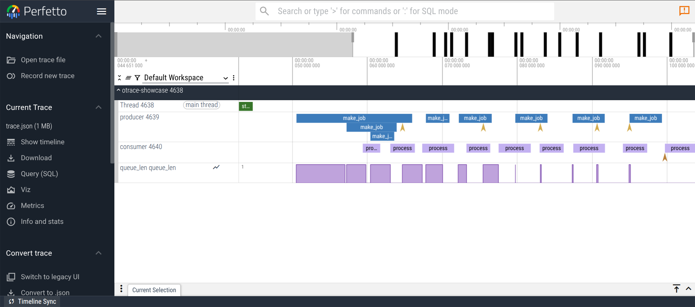
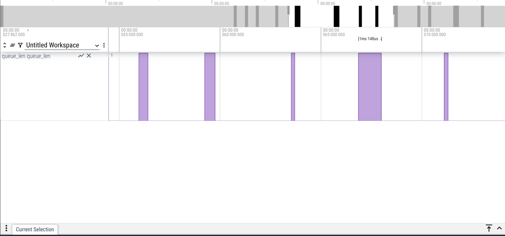
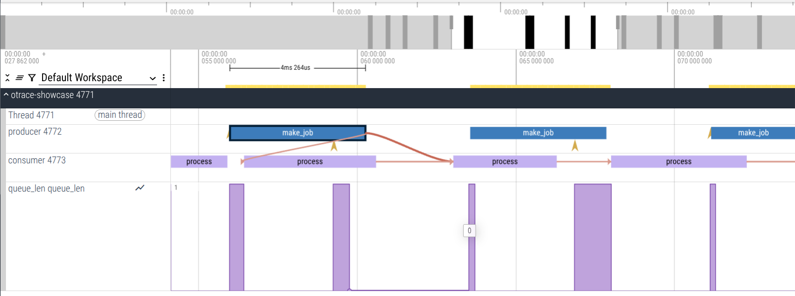
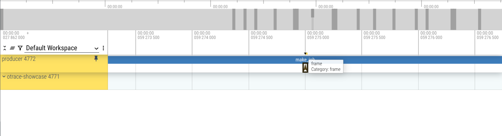

## Table of contents

- [Getting started](#getting-started)
- [What you can emit (and how it appears)](#what-you-can-emit-and-how-it-appears)
- [How timestamps work (and what to choose)](#how-timestamps-work-and-what-to-choose)
- [Buffering, flushing, and the file on disk](#buffering-flushing-and-the-file-on-disk)
- [Building and toggling features](#building-and-toggling-features)
- [Examples on the timeline (with screenshots)](#examples-on-the-timeline-with-screenshots)
- [Why header-only?](#why-header-only)
- [Thread-safety model](#thread-safety-model)
- [Disabling at runtime (and what it actually does)](#disabling-at-runtime-and-what-it-actually-does)
- [Memory cost and sizing](#memory-cost-and-sizing)
- [Compile-time configuration (definitions you can set)](#compile-time-configuration-definitions-you-can-set)
- [A mid-sized example (end-to-end, but not a wall of code)](#a-mid-sized-example-end-to-end-but-not-a-wall-of-code)
- [FAQ](#faq)
- [Privacy & Security](#privacy--security)
- [License](#license)
- [Troubleshooting](#troubleshooting)


## `otrace.hpp`
is a single header that lets you annotate your C++ code with timeline events and then inspect them in Perfetto UI or chrome://tracing. You sprinkle a few macros around the code you care about, scopes, instants, counters, flows, frames, and the program produces a compact `trace.json`. Open that file in a timeline viewer and you can finally _see_ what your application did, when it did it, and on which threads, with microsecond resolution and essentially no setup beyond including one header.

This isn’t a sampling profiler or a system-wide tracer. It is deliberate, in-process instrumentation you control. Nothing is captured unless you emit it, which means the timeline shows the exact narrative you intended: your critical sections, your I/O, your queues, your handoffs, the shape of a frame, the path of a task.

## Getting started

Add the header to your project. Build your program with C++17 or later and define `OTRACE=1` to enable instrumentation. When `OTRACE` is left at the default `0`, every macro compiles out to a no-op, so there’s no overhead in production by default. Add `-pthread` on Linux when using threads (it’s accepted and harmless on macOS/Clang).
```cpp
// main.cpp
#define OTRACE 1
#include "otrace.hpp"

#include <thread>
#include <vector>
#include <chrono>

void work_unit(int i) {
  TRACE_SCOPE_CKV("work_unit", "compute", "i", i);
  std::this_thread::sleep_for(std::chrono::milliseconds(5 + (i % 3)));
  TRACE_COUNTER("queue_len", 42 - i);
}

int main() {
  TRACE_SET_PROCESS_NAME("otrace-demo");
  TRACE_SET_OUTPUT_PATH("trace.json");       // optional; defaults to "trace.json"

  {
    TRACE_SCOPE("startup");
    std::this_thread::sleep_for(std::chrono::milliseconds(10));
    TRACE_INSTANT("tick");
  }

  // a few tasks, to make the timeline interesting
  for (int i = 0; i < 6; ++i) {
    work_unit(i);
  }

  TRACE_FLUSH(nullptr);                      // optional; on-exit flush is on by default
  return 0;
}

```

otrace requires **C++17+** and works on Windows/Linux/macOS so you can build it with your compiler of choice:
- Clang or GCC:
    
    `c++ -std=c++17 -O2 -DOTRACE=1 main.cpp -o demo`
    
- MSVC:
    
    `cl /std:c++17 /O2 /EHsc /DOTRACE=1 main.cpp`
Run the program; you’ll find a `trace.json` in the current directory (or whatever path you set). Drag and drop that file into **Perfetto UI** at https://ui.perfetto.dev or open chrome://tracing in Chrome and use the “Load” button. You’ll see your process and threads on the left, and on the right a time axis with colored slices for scopes, vertical pins for instants, graphs for counters, and optional arrows for flows.

## What you can emit (and how it appears)

The goal is that the timeline tells a story without needing a log window. The primitives are small, but expressive.

**Scopes** are the backbone. A scope is a block of time that starts when you enter a piece of code and ends when you leave it. The macro captures this as a single “complete” event with a duration. You can optionally attach a category and a small numeric argument.
```cpp
{
  TRACE_SCOPE("parse_config");                 // a single colored bar in the timeline
  // your code here
}

{
  TRACE_SCOPE_C("db_roundtrip", "io");         // categorize similar scopes
  // your code here
}

{
  TRACE_SCOPE_CKV("render", "gpu", "triangles", triangle_count);
  // your code here
}

```
In the viewer, each becomes a colored slice on the thread’s lane, with the name and category available on hover, and with the extra argument visible in the details. The width of the slice is its measured duration.

**Begin/End pairs** let you mark a long-lived operation when RAII isn’t convenient. They produce two separate events that the viewer stitches into a block.
```cpp
TRACE_BEGIN("upload");
// do the upload
TRACE_END("upload");
```
Most of the time, the RAII `TRACE_SCOPE*` is simpler and safer; reach for begin/end when you truly need to separate boundaries.

**Instants** are zero-duration markers. They show up as thin vertical pins in the timeline. They are perfect for “we hit this branch,” “we just swapped buffers,” or “tick” style annotations. As of 0.2.0 you can attach several key/values at once, and values may be numbers or short strings, so a single instant can carry all the detail you care about without emitting a cluster of adjacent events
```cpp
TRACE_INSTANT("tick");
TRACE_INSTANT_C("tick", "frame");
TRACE_INSTANT_KV("gc_note", "text", "minor");                      // single string
TRACE_INSTANT_CKV("gc", "runtime", "major", 1, "bytes", 524288);   // multiple KVs
```
**Counters** are values over time. They render as line charts under the timeline so you can correlate trends against phases above, queue sizes draining, memory climbing, FPS oscillating. You can emit a single series or a small group under the same name.
```cpp
// On every enqueue/dequeue site:
TRACE_COUNTER("queue_len", static_cast<int>(queue.size()));
TRACE_COUNTER2("mem_kb", "rss", rss_kb, "cache", cache_kb);
```
**Flows** connect related points, even across threads. You supply an id that is stable for that logical item (a pointer cast to uint64_t is a handy candidate). The viewer draws arrows so you can visually follow a handoff.
```cpp
uint64_t id = (uint64_t)task_ptr;
TRACE_FLOW_BEGIN(id);                         // where the task is born or enqueued
// ... maybe enqueued to another thread ...
TRACE_FLOW_STEP(id);                          // intermediate step(s)
TRACE_FLOW_END(id);                           // finally handled or completed
```
**Frames** are just a convention for a recurring instant with name `"frame"`. The library provides helpers so you don’t have to repeat the details.
```cpp
TRACE_MARK_FRAME(frame_index);                // cat:"frame", args:{ frame:<index> }
TRACE_MARK_FRAME_S("present");                // args:{ label:"present" }
```
In Perfetto you can filter for `name:"frame"` to line up “a frame worth of work.”

**Metadata** isn’t about time; it’s about making the view readable. Give the process and each thread a human name and a sort position if you want control over their vertical order in the UI.
```cpp
TRACE_SET_PROCESS_NAME("imgproc");
TRACE_SET_THREAD_NAME("worker-0");
TRACE_SET_THREAD_SORT_INDEX(10);              // bigger numbers go lower in the stack
```
**Color hints (`cname`)**  
If you want a specific event to stand out, hint a color for the **next** emission. Perfetto understands several canonical names (e.g. `"good"`, `"bad"`, `"terrible"`) and maps them to consistent palette colors.

```cpp
TRACE_COLOR("good");          // the *next* event will carry cname:"good"
TRACE_SCOPE("hot_path");      // only this event gets the hint
```
## How timestamps work (and what to choose)

Every timestamp in `trace.json` is **microseconds since first use** within your process. The source can be chosen at build time:

- The default uses `std::chrono::steady_clock`. It is monotonic and immune to wall-clock corrections. It’s the right answer for almost everyone.
    
- On x86 you can choose an `RDTSC` timebase by compiling with `-DOTRACE_CLOCK=2`. The header fences the instruction to reduce out-of-order noise and calibrates cycles to microseconds against `steady_clock` during startup. It is extremely cheap to read. Use it when you need very fast timestamps and you’re confident your environment has an invariant TSC.
    
- A third option uses `std::chrono::system_clock` (compile with `-DOTRACE_CLOCK=3`). This gives you wall-clock deltas and is susceptible to NTP or manual adjustments; it is rarely needed unless you want to align a trace with external logs by wall time.

- RDTSC assumes an invariant, synchronized TSC. On some laptops, VMs, and turbo/parking scenarios, calibration can be noisy; if in doubt, use the default steady_clock. If you see discontinuities or negative deltas on laptops/VMs, switch back to steady_clock (OTRACE_CLOCK=1).

If you compile with `OTRACE_CLOCK=2` on a non-x86 target, the header silently falls back to `steady_clock`.
## Buffering, flushing, and the file on disk

Each thread that touches the API gets a per-thread ring buffer with a fixed number of events (the default is `32768` per thread and can be tuned with `-DOTRACE_THREAD_BUFFER_EVENTS=<N>`). Appending an event reserves a slot, fills in the fields, and finally marks it committed with a single atomic store. The thread never locks. If the ring wraps, the oldest entries on that thread are overwritten.

When you call `TRACE_FLUSH(path)` (or when the process exits, because the default `-DOTRACE_ON_EXIT=1` arranges an atexit handler), the library briefly stops accepting new appends, copies committed events out of each thread’s buffer, adds metadata, sorts the events by time (with a stable tiebreaker), and writes them as a single JSON object with a `"traceEvents"` array. If the file cannot be opened, it restores the previous state and returns without aborting your program. You can change the default path at runtime via `TRACE_SET_OUTPUT_PATH("runs/trace.json")`.

## Building and toggling features

The header is designed to be self-contained and friendly to typical build setups. You include it exactly once per translation unit where you want to instrument (there are no link-time components). At build time, a handful of macros control behavior:

- `OTRACE` set to `1` enables instrumentation. Leaving it at `0` compiles every macro out to a no-op.
    
- `OTRACE_THREAD_BUFFER_EVENTS` lets you scale the per-thread ring size up or down.
    
- `OTRACE_DEFAULT_PATH` can change the default filename from `"trace.json"` to something like `"out/trace.json"`.
    
- `OTRACE_ON_EXIT` controls whether a flush happens at process exit; it is `1` by default.
    
- `OTRACE_CLOCK` chooses the timebase as described above.
    

At runtime you can also toggle collection:
```cpp
TRACE_DISABLE();                 // temporarily stop collecting
// do something noisy
TRACE_ENABLE();                  // resume
if (TRACE_IS_ENABLED()) { /* ... */ }
```
This can be valuable in long-running services where you only want a window of detail.

## Examples on the timeline (with screenshots)

The repository includes a handful of screenshots under `docs/images/` so you can glance at what to expect right in the README. They were captured from Perfetto UI using small sample programs built with the header. Screenshots from chrome://tracing will be added soon.

### 1)  **Overview timeline** threads, scopes, and instants

This view shows the big picture: per-thread rows, named slices from `TRACE_SCOPE` / `TRACE_BEGIN`…`TRACE_END`, and instant markers. In this trace the **producer** thread enqueues work (`make_job`), the **consumer** thread runs it (`process` slices), and the **main** thread is mostly idle. The dark tick marks in the top ruler are scheduler activity; you can gauge overlap and gaps at a glance.

<p align="center">
  
</p>

The producer emits `make_job` while the consumer runs `process`; overlap shows pipeline fill, gaps show stalls.

**Minimal Repro:**
```cpp
TRACE_SET_PROCESS_NAME("otrace-showcase");
TRACE_SET_THREAD_NAME("producer");
{
  TRACE_SCOPE_C("make_job", "compute");
  TRACE_INSTANT_CKV("submit", "flow", "enqueue", 1);
  // enqueue work...
}
TRACE_SET_THREAD_NAME("consumer");
{
  TRACE_SCOPE("process");
  // do the work...
}
```

### 2) Counter track: live value over time

Here we’re plotting a queue length. The counter renders as a time-series under the thread tracks. Correlate rises/falls with the slices above to explain latency spikes or under-utilization.
<p align="center">  </p>

**Minimal Repro**:
```cpp
// On enqueue/dequeue:
TRACE_COUNTER("queue_len", static_cast<int>(queue.size()));
```


### 3) Flows, causal arrows across threads

The orange arrows below connect a `make_job` slice on the producer to the corresponding `process` slice on the consumer. Use `TRACE_FLOW_BEGIN(id)` at the source, `TRACE_FLOW_STEP(id)` for hops, and `TRACE_FLOW_END(id)` at the sink. Pick a stable `id` (e.g., your job id).

<p align="center">  </p>
Arrows link a job’s creation on producer to its handling on consumer; breaks in arrows indicate queueing latency.

**Minimal Repro**:
```cpp
uint64_t job_id = /* your stable id (e.g., queue index or pointer cast) */;

// Producer:
TRACE_FLOW_BEGIN(job_id);
TRACE_SCOPE("make_job");
// ...enqueue...
TRACE_FLOW_STEP(job_id);

// Consumer:
TRACE_SCOPE("process");
// ...work...
TRACE_FLOW_END(job_id);

```

### 4) Frames per-frame markers
Frames are emitted as **Instant** events with **`name:"frame"`** (and the helpers also set `cat:"frame"`). In Perfetto you can hit `/` (Find) and search for **`name:"frame"`** to jump between markers, or filter by **`name:"frame"`** to isolate them as a track.
In this example we mark frame indices via `TRACE_MARK_FRAME(i)` (numeric) or phases via `TRACE_MARK_FRAME_S("present")` (string label).
<p align="center">  </p>

**Minimal Repro:**
```cpp
for (int i = 0; i < N; ++i) {
  TRACE_MARK_FRAME(i);          // numeric index
  // or: TRACE_MARK_FRAME_S("present");

  // Do per-frame work
  TRACE_SCOPE("update");
  TRACE_SCOPE("render");
}
```

## Why header-only?

Integration friction kills adoption. A single header means:

- **Zero link steps and zero external deps.** Drop the file in, include it where you want instrumentation, and build. No cmake targets to wire up, no .lib/.a to ship.
    
- **Inline hot path.** The event fast path is a handful of trivial inline calls that the compiler optimizes well. There’s no virtual dispatch or cross-TU state to synchronize.
    
- **ODR-safe by design.** All functions are `inline` in the header, and global singletons use function-local statics; multiple TUs include the header without violating ODR.
    
- **Easy to disable.** With `OTRACE=0` the macros disappear at compile time; the header leaves no trace in your binary.
    

Trade-off to be aware of: your compile times will include this header in every TU that uses it. In practice this is negligible compared to typical project headers, and you get the simplicity and performance benefits above.

## Thread-safety model

Events are appended to a **per-thread ring buffer**. Each thread owns its ring and writes to it **without locks** (single-writer). An append reserves a slot, fills fields, then sets an `atomic<uint8_t>` “committed” flag. Readers (the flush code) only copy **committed** events with `memory_order_acquire`, so in-flight writes are never observed.

This model has a few consequences that are worth calling out:

- **No cross-thread synchronization on the hot path.** One thread cannot block another while recording.
    
- **Back-pressure is bounded and local.** If a thread overruns its ring, only that thread drops its own oldest events; other threads are unaffected.
    
- **Exception-safe scopes.** `TRACE_SCOPE*` emits in the destructor; if you throw out of a block, the close is still recorded.
    
- **Not async-signal-safe.** Don’t call the macros from signal handlers or other contexts with severe restrictions.
    
- **After `fork()`.** The PID is recomputed lazily on first use in the child. As with any `fork()`+threads scenario, call into the API only from the post-fork thread unless you `exec()`.

## Disabling at runtime (and what it actually does)

`TRACE_DISABLE()` flips a global atomic that makes the fast-path **early-out**. No state is torn down, no buffers are cleared; you simply stop appending new events. `TRACE_ENABLE()` turns recording back on.

This is useful when you want a clean window of activity—e.g., disable during warm-up, enable for five seconds under load, flush, then disable again. If you need a snapshot **now**, call `TRACE_FLUSH(nullptr)`; it briefly pauses appends, copies committed events to a vector, writes `trace.json`, and restores the previous enabled state.

## Memory cost and sizing

Each thread gets a ring of `OTRACE_THREAD_BUFFER_EVENTS` **Event** structs. The total resident memory of the tracer is approximately:
```cpp
memory_per_thread ≈ OTRACE_THREAD_BUFFER_EVENTS × sizeof(otrace::Event)
total_memory       ≈ (sum over threads) memory_per_thread
```

`otrace::Event` is intentionally simple but not tiny: it stores names, category, a color hint, a handful of small arguments, and some IDs. The exact size depends on your compiler/ABI and the macro sizes you chose:

- With the defaults (`OTRACE_MAX_ARGS=4`, `name=64`, `cat=32`, `argv=64`), **expect ~500–700 bytes per event** on 64-bit builds.
    
- At the default ring size of `32768` events, that’s **~16–22 MiB per actively instrumented thread**.
    
- You can tune both knobs:
    
    - **Fewer events per thread:** `-DOTRACE_THREAD_BUFFER_EVENTS=8192`
        
    - **Smaller fields / fewer args:** `-DOTRACE_MAX_ARGS=2`, `-DOTRACE_MAX_NAME=48`, etc.
        

If you want a hard number for your configuration, print it once at startup:
```cpp
printf("otrace: Event=%zu bytes, ring=%u, per-thread≈%.1f MiB\n",
       sizeof(otrace::Event),
       (unsigned)OTRACE_THREAD_BUFFER_EVENTS,
       (sizeof(otrace::Event) * 1.0 * OTRACE_THREAD_BUFFER_EVENTS) / (1024*1024));

```

## Compile-time configuration (definitions you can set)

You already saw `OTRACE` and `OTRACE_CLOCK`. Here’s the full set you can override at compile time. They all have sane defaults; only change what you need.

- `OTRACE`  
    `0` disables everything (macros become no-ops). `1` enables recording.
    
- `OTRACE_THREAD_BUFFER_EVENTS`  
    Number of events in each thread’s ring. Default `1<<15` (32768).
    
- `OTRACE_DEFAULT_PATH`  
    Default output file. Default `"trace.json"`. You can still change it at runtime with `TRACE_SET_OUTPUT_PATH()`.
    
- `OTRACE_ON_EXIT`  
    `1` installs an `atexit` flush; `0` disables auto-flush.
    
- `OTRACE_CLOCK`  
    `1` = `steady_clock` (default, monotonic).  
    `2` = `RDTSC` on x86 with fences + calibration.  
    `3` = `system_clock` (wall-clock deltas).
    
- `OTRACE_MAX_ARGS`  
    Max number of arguments you can attach to an event (small numbers are better for cache and file size). Default `4`.
    

Advanced (rarely needed, but available if you need to trim strings):

- `OTRACE_MAX_NAME` (default `64`), `OTRACE_MAX_CAT` (`32`), `OTRACE_MAX_ARGK` (`32`), `OTRACE_MAX_ARGV` (`64`), `OTRACE_MAX_CNAME` (`16`).
    

You set these with your usual build flags, e.g.:
```sh
c++ -std=c++17 -O2 -DOTRACE=1 -DOTRACE_CLOCK=2 -DOTRACE_THREAD_BUFFER_EVENTS=8192 main.cpp

```

## A mid-sized example (end-to-end, but not a wall of code)

This is a pared-down producer/consumer that exercises scopes, counters, flows, frames, and metadata. It’s short enough to read in one sitting, but rich enough to produce all the tracks shown in the screenshots.
```cpp
// demo.cpp
#define OTRACE 1
#include "otrace.hpp"

#include <thread>
#include <queue>
#include <mutex>
#include <condition_variable>
#include <chrono>

struct Job { uint64_t id; int payload; };

int main() {
  TRACE_SET_PROCESS_NAME("otrace-demo");
  TRACE_SET_OUTPUT_PATH("trace.json");

  // A short boot phase with a scope and an instant.
  {
    TRACE_SCOPE("startup");
    std::this_thread::sleep_for(std::chrono::milliseconds(8));
    TRACE_INSTANT_C("tick", "boot");
  }

  std::queue<Job> q;
  std::mutex m;
  std::condition_variable cv;
  bool done = false;

  auto producer = std::thread([&]{
    TRACE_SET_THREAD_NAME("producer");
    TRACE_SET_THREAD_SORT_INDEX(10);

    for (int i = 0; i < 10; ++i) {
      TRACE_SCOPE_CKV("make_job", "compute", "i", i);
      std::this_thread::sleep_for(std::chrono::milliseconds(3 + (i & 1)));
      Job j{ (uint64_t)i, i };

      TRACE_FLOW_BEGIN(j.id);          // follow this job through the system
      {
        std::lock_guard<std::mutex> lk(m);
        q.push(j);
        TRACE_COUNTER("queue_len", (int)q.size());
      }
      cv.notify_one();

      TRACE_MARK_FRAME(i);             // mark a frame boundary with index i
    }

    { std::lock_guard<std::mutex> lk(m); done = true; }
    cv.notify_all();
    TRACE_MARK_FRAME_S("present");     // label a “present” event
  });

  auto consumer = std::thread([&]{
    TRACE_SET_THREAD_NAME("consumer");
    TRACE_SET_THREAD_SORT_INDEX(20);

    for (;;) {
      Job j{};
      {
        std::unique_lock<std::mutex> lk(m);
        cv.wait(lk, [&]{ return done || !q.empty(); });
        if (q.empty()) break;
        j = q.front(); q.pop();
        TRACE_COUNTER("queue_len", (int)q.size());
      }

      TRACE_COLOR("good");             // make the next event stand out
      TRACE_SCOPE_CKV("process", "io", "job", (double)j.id);
      TRACE_FLOW_STEP(j.id);
      std::this_thread::sleep_for(std::chrono::milliseconds(2 + (j.payload % 3)));
      TRACE_FLOW_END(j.id);
    }

    TRACE_INSTANT_C("tick", "shutdown");
  });

  producer.join();
  consumer.join();

  TRACE_FLUSH(nullptr);                // write trace.json
  return 0;
}

```

Build and run:
```
c++ -std=c++17 -O2 -pthread -DOTRACE=1 demo.cpp -o demo && ./demo
```
Open `trace.json` in **Perfetto UI**. You should see:

- **Overview** with `startup`, `make_job`, and `process` scopes across named threads.
    
- A **counter track** named `queue_len` that rises and falls as the queue fills and drains.
    
- **Flow arrows** linking producer slices to consumer slices with the same `Job.id`.
    
- **Frame markers** (“frame” instants) you can search for by name.
    

This is essentially the example that produced the three screenshots in the README.

## FAQ

**Is there any overhead when `OTRACE=0`?**  
No. All macros expand to empty statements. There is no runtime code or data emitted.

**How much overhead when it’s enabled?**  
The hot path is a few stores to a thread-local ring and one relaxed→release atomic store. On typical desktop x86 builds this is tens of nanoseconds per event with `OTRACE_CLOCK=1`. If you’re extremely sensitive to overhead, prefer `TRACE_SCOPE` over separate `TRACE_BEGIN`/`TRACE_END`, avoid string args in tight loops, and consider `OTRACE_CLOCK=2` on invariant-TSC hardware.

**Do I need to initialize the library?**  
No. A tiny `atexit` hook is installed on first use. The first macro you call takes care of it.

**Why do flows sometimes not render in Chrome’s legacy viewer?**  
The old importer is brittle. Perfetto UI is more robust and actively maintained. If Chrome errors on import, open the same `trace.json` in Perfetto.

**What happens if the process crashes before exit?**  
On-exit flush won’t run. If you’re diagnosing crashes, sprinkle `TRACE_FLUSH(nullptr)` at key points (or on a watchdog timer) to snapshot buffers periodically.

**Can I log strings and large objects?**  
Arguments are small by design: numeric or short strings (bounded by `OTRACE_MAX_ARGV`). For large blobs, emit an ID in the trace and write the blob elsewhere (log file, sidecar JSON).

**How do I control the vertical order of tracks?**  
Call `TRACE_SET_THREAD_SORT_INDEX(n)`. Higher numbers appear lower in Perfetto; group related threads by index ranges.

**Can I use it from a dynamic library loaded into another process?**  
Yes. It’s purely in-process and header-only. Each process that includes and uses `otrace.hpp` writes its own `trace.json` unless you override the path.

**What time units are in the JSON?**  
Microseconds since first use (`ts`/`dur`). That’s what Perfetto and Chrome’s trace viewer expect.

**Why does `chrome://tracing` reject a file that opens in Perfetto?**  
Perfetto UI is the reference viewer for Chrome Trace Event JSON and is actively maintained. If Chrome rejects a trace that works in Perfetto, prefer Perfetto.

## Privacy & Security

`otrace.hpp` is strictly **in-process** and writes a local `trace.json`. It does not sample the OS, inject into other processes, open network sockets, or require elevated permissions. That said, traces can still leak information if you put sensitive data into event names/args.

- **Only emit what you’re comfortable sharing.** Don’t put secrets (API keys, tokens, DB URIs, customer PII) in `TRACE_*` names or string args. Prefer IDs or coarse labels.
- **Prefer IDs/hashes over raw values.** If you need to correlate, emit a stable numeric ID (or a short hash) and keep the mapping elsewhere.
- **Mind file paths & perms.** `TRACE_SET_OUTPUT_PATH()` writes wherever you point it. Keep traces out of shared/temp directories and out of public repos by default.
- **Redaction for sharing.** Before posting a trace publicly, scrub or regenerate it with sanitized names/args. The JSON is simple enough to post-process.
- **Runtime control.** Leave `OTRACE=0` in default production builds, or gate tracing behind a config/env flag so you don’t emit timelines by accident.

Implementation notes: JSON output is escaped; event writes are lock-free and local to each thread; there’s no async-signal safety guarantee; `RDTSC` mode reads TSC on x86 but does not touch privileged registers or timers.


## License

Released under the **MIT License**. See `LICENSE` for the full text.


## Troubleshooting

If you built and ran and still don’t see a `trace.json`, the most common reasons are straightforward. Make sure you compiled with `-DOTRACE=1` so the macros actually do something. Confirm that the program can write to the working directory or set a different path at runtime with `TRACE_SET_OUTPUT_PATH`. If your process crashes before exit, call `TRACE_FLUSH(nullptr)` earlier to snapshot the buffers; the on-exit flush is best-effort. If your timestamps look strange with `OTRACE_CLOCK=2`, try the default timebase first; VMs and some laptops can present non-invariant TSC behavior that a calibration pass can’t fully tame.
**MSVC says C++17 is too old?**  
Add `/Zc:__cplusplus` to your compiler flags (or build with clang-cl). MSVC otherwise reports `__cplusplus` as 199711L even when `/std:c++17` is used.

