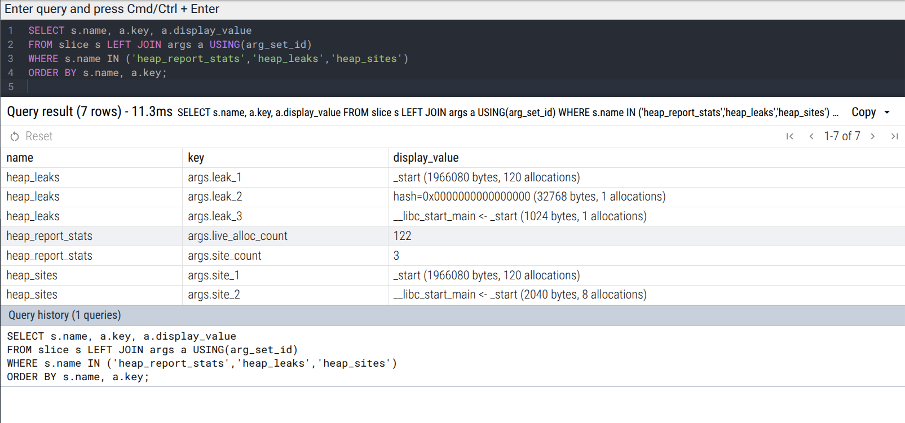

# Heap tracing & leak report (since 0.2.0)

The heap tracer is an opt-in layer that rides on the regular recorder. When enabled it counts live heap bytes, attributes traffic to allocation sites using tiny sampled stacks, and, only when you ask for it, synthesizes a compact end-of-run leak report directly into your trace. There are no background threads and no external services; output stays plain Chrome Trace JSON that Perfetto reads without adapters.

## Enabling, building, and toggling

Build with the recorder and the heap tracer on. Define the global `new/delete` hooks in exactly one translation unit; include the header in that TU after setting the flag.
```cpp
# recorder + heap tracer (+ readable symbols on Linux)
c++ -std=c++17 -O2 -g -pthread -rdynamic \
  -DOTRACE=1 -DOTRACE_HEAP=1 -DOTRACE_HEAP_STACKS=1 -DOTRACE_DEFINE_HEAP_HOOKS=1 \
  main.cpp -o heap_demo
```
The hooks only attach in the TU that defines `OTRACE_DEFINE_HEAP_HOOKS`. Do not define it anywhere else. If your process already overrides global `new/delete`, skip this flag; the heap tracer still works for manual counters and the end-of-run report using allocations visible through the hooked operators.

Optional compile-time knobs exist with conservative defaults. `OTRACE_HEAP_SAMPLE` initializes the runtime sampling probability (default `0.0`); `OTRACE_HEAP_STACK_DEPTH` caps the captured backtrace depth (default `8`); `OTRACE_HEAP_DEMANGLE=1` enables libc++abi demangling when available. On Linux the stack capture uses `<execinfo.h>` if present; on Windows it uses `CaptureStackBackTrace` if `<dbghelp.h>` is available when `OTRACE_HEAP_DBGHELP=1`. None of these change the file format.

At runtime you bring the tracer up first, then arm the heap layer, then choose a sampling rate. All toggles are hot and cheap.
```cpp
OTRACE_ENABLE();                 // recorder on
TRACE_SET_OUTPUT_PATH("trace.json");
OTRACE_HEAP_ENABLE(true);        // start capturing alloc/free
OTRACE_HEAP_SET_SAMPLING(0.15);  // capture short stacks for ~15% of sites
```
Turning the heap tracer off stops recording new heap events but preserves everything collected so far. You can raise or drop the sampling rate at any time without restarting.

## What gets recorded

There are two products and they live in the same file as your normal events. The first is a live counter named `heap_live_bytes` under category `heap`. It reflects allocations minus frees and is emitted opportunistically from the hot path with an internal throttle of one update per second. Use it to see spikes and to sanity-check shutdown: if a test should be leak-free, the last value should return to zero or near-zero.

The second is the leak report, emitted only on request. It appears as a handful of zero-duration instants with names under `heap_*`. When you call `OTRACE_HEAP_REPORT()` the code snapshots the live allocation table, groups entries by sampled callsite hash, and appends a compact, table-shaped summary:

- `heap_report_started` and `heap_report_done` are breadcrumbs so you can confirm when the snapshot ran.
    
- `heap_report_stats` carries `live_alloc_count` (number of outstanding allocations) and `site_count` (distinct site hashes among those allocations).
    
- `heap_leaks` lists the top live groups by bytes. Each key is `leak_1`, `leak_2`, … and the value is a readable, compact stack if one was sampled for that site, followed by `(N bytes, M allocations)`. If no stack was sampled, the value falls back to a stable `hash=0x…` with the same totals.
    
- `heap_sites` lists the hottest allocation sites by total bytes allocated during the run, regardless of whether they leaked. Keys are `site_1`, `site_2`, … with representative stacks and totals. If you ran with sampling disabled the row still appears with `info="no_callsite_info_available"`.
    

Nothing about these shapes is special to Perfetto; they are ordinary Chrome Trace “I” events with arguments under `args`.

## Minimal, deterministic usage
```cpp
#include <vector>
#include "otrace1.hpp"

int main() {
  OTRACE_ENABLE();
  TRACE_SET_OUTPUT_PATH("heap_demo.json");
  TRACE_INSTANT("program_start");           // prevent empty file if you misconfigure heap

  OTRACE_HEAP_SET_SAMPLING(1.0);            // guarantee site attribution in this window
  OTRACE_HEAP_ENABLE(true);

  std::vector<char*> junk;
  for (int i = 0; i < 120; ++i) junk.push_back(new char[1 << 14]);
  (void)new char[1024];                     // small intentional leaks
  (void)new char[2048];

  OTRACE_HEAP_SET_SAMPLING(0.0);            // keep heap enabled; quiet the hooks
  OTRACE_HEAP_REPORT();                     // emits heap_report_stats/leaks/sites
  TRACE_INSTANT("report_done");

  TRACE_FLUSH(nullptr);
  OTRACE_HEAP_ENABLE(false);
  OTRACE_DISABLE();
}
```

Run it and open the file in Perfetto. In the search bar type `heap`. You should see the two breadcrumbs plus the report rows, and in the Counters pane a `heap_live_bytes` lane that climbs while you allocate. In the SQL console, this one-liner shows the report in a single grid:
```sql
SELECT s.name, a.key, a.display_value
FROM slice s LEFT JOIN args a USING(arg_set_id)
WHERE s.name IN ('heap_report_stats','heap_leaks','heap_sites')
ORDER BY s.name, a.key;
```
<p align="center">  </p>

## Reading the output

Treat `heap_live_bytes` as ground truth for “what is live right now”. If it never comes down at the end of a supposedly leak-free test, you have a leak even if you didn’t sample a stack. Use `heap_leaks` to prioritize fixes; it is already sorted by bytes. When a row shows only a hash, you didn’t sample that site—re-run with a higher sampling rate or temporarily force `1.0` around the suspicious workload to capture a representative stack. Use `heap_sites` to find churny hot spots that may not leak but dominate allocator traffic.

Values in `heap_*` rows are emitted as human-readable strings. Stacks are compacted to function names with demangling when you build with `-rdynamic` and `OTRACE_HEAP_DEMANGLE=1`. The stack formatter intentionally skips the first two frames so you see your callsites rather than the hook internals.

## Behavior, edge conditions, determinism

The reporter runs only if the heap tracer is enabled at the time you call it. Disabling the heap subsystem right before the report turns the reporter into a no-op; keep it enabled and, if you are worried about reentrancy cost during the snapshot, drop the sampling probability to zero for the duration of the report as shown above. Sampling does not gate _whether_ a report is produced; with `p=0` you still get `heap_report_stats` and `heap_leaks`, but values fall back to the hash format and `heap_sites` will carry an informational note rather than stacks.

The snapshot takes a consistent view by locking each shard, copying its table, and releasing the lock before moving on. Sorting is deterministic; emission is ordinary tracing with the standard `TracerGuard` so allocations performed by the tracer itself are not re-captured. The live counter is throttled to at most one emission per second, so do not expect a point for every allocation burst; it reflects the current total at the update moments.

On shutdown you should disarm the heap layer before global destructors run if your process is crash-sensitive there. This avoids late `delete` traffic trying to touch a recorder you’ve already torn down:
```cpp
TRACE_FLUSH(nullptr);
OTRACE_HEAP_ENABLE(false);
OTRACE_DISABLE();
```
## Costs

The hot path on every allocation updates a sharded pointer map and a 64-bit counter; on a sample hit it walks a short backtrace and updates a per-site aggregate. The sharding keeps mutex contention low even with many threads. The end-of-run report cost scales with “live allocations at snapshot time” and “distinct sampled sites seen so far”; it is a single-threaded pass with stable sorts and emits only a few instants, so file size growth is negligible compared to real event traffic.

For long-running debug sessions choose a small sampling rate such as `0.05–0.2` and briefly crank it to `1.0` around workloads you want fully attributed. For forensic runs you can leave it at `1.0`; the tracer is designed to degrade gracefully, but backtrace/symbolization cost is real on some platforms.

## Interop, rotation, and filters

Output rotation and gzip work unchanged: the reporter simply appends more events before your next flush. If you use rotation, run the reporter before the final `TRACE_FLUSH` that writes the file you intend to open so the `heap_*` rows land where you expect them. Category filters do not strip heap rows unless you explicitly filter out category `"heap"` yourself; if you enabled strict filters earlier in the run and forgot, clear them before calling the reporter.

## Troubleshooting

If the file opens in Perfetto but your search for `heap` finds nothing, you either never called `OTRACE_HEAP_REPORT()` before the flush you opened, or you disabled the heap subsystem prior to the report. If your `heap_sites` row contains only `info="no_callsite_info_available"`, you ran with sampling too low for the sites you exercised; raise it and retry the same workload. If you ever saw a hang while reporting with hooks armed, use the deterministic pattern above: keep the heap subsystem enabled so the reporter runs, but set sampling to zero during the report so any allocations it performs are ignored by the hooks and no shard locks are contended in a reentrant path.
